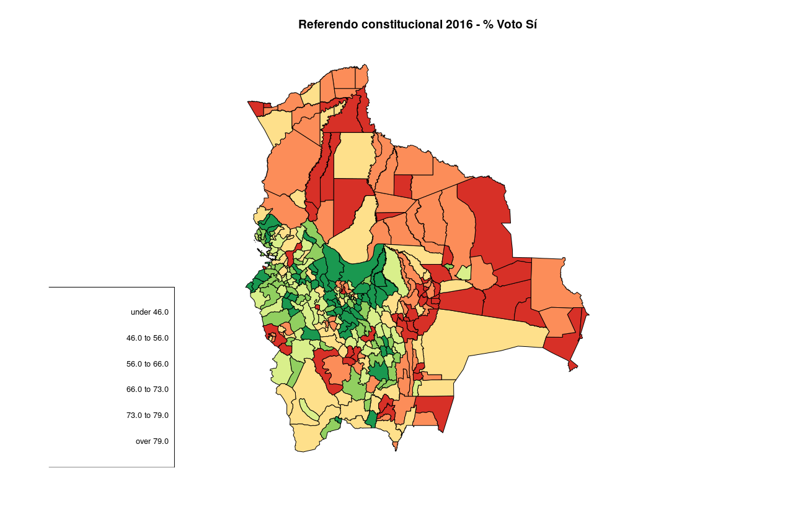
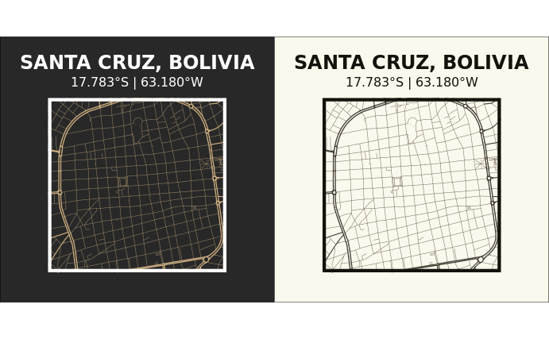
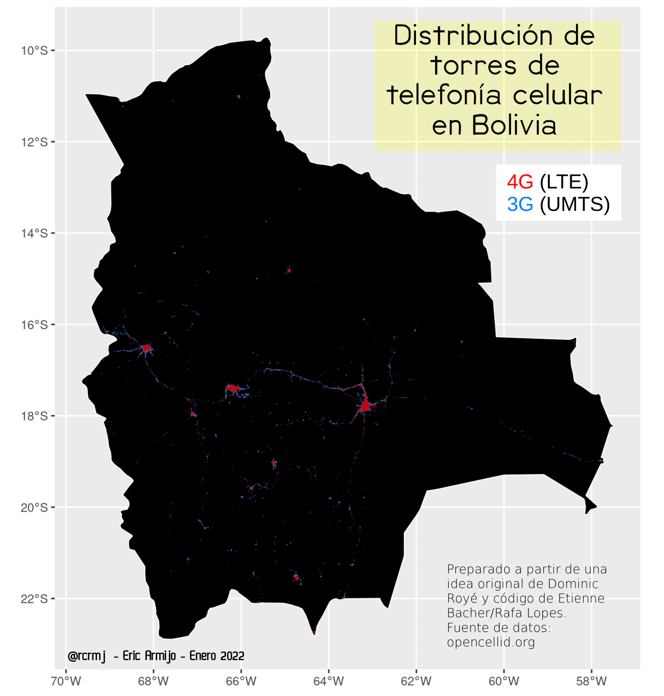
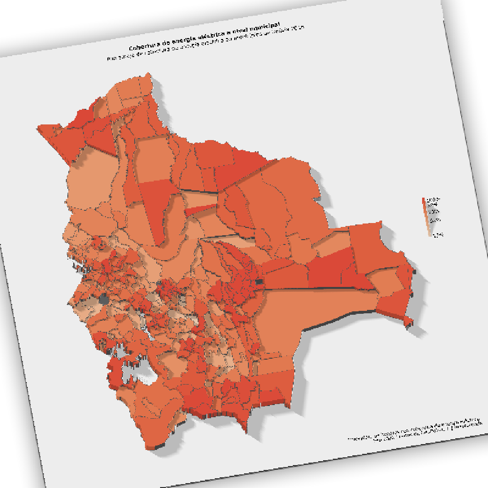
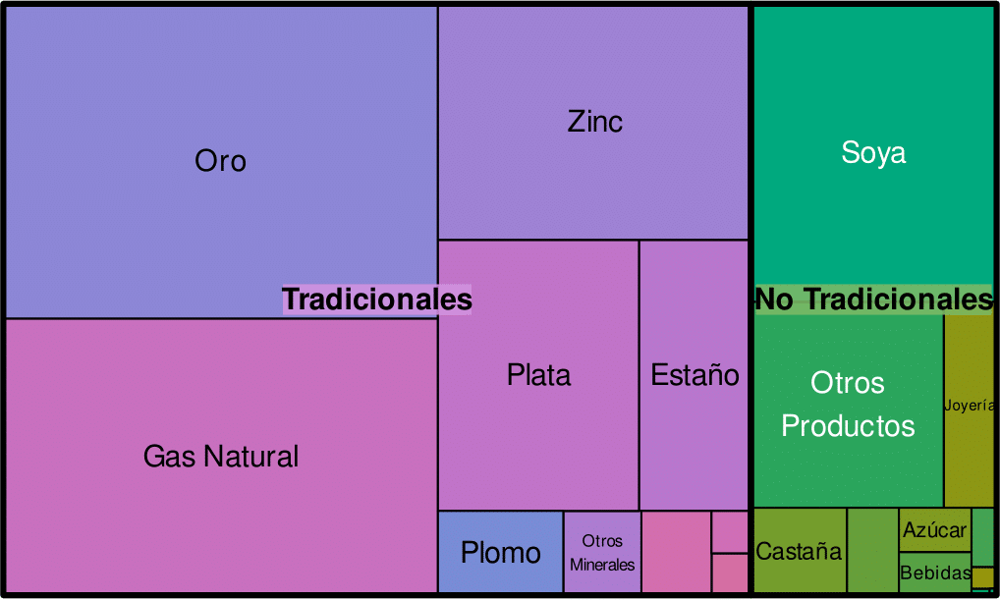

# R_visdat

**Visualización de datos con R**

Exploraciones en visualización de datos con múltiples funciones de R

---

## 📊 Contenido

| Proyecto             |  Gráfico |
:-------------------------:|:-------------------------:
[Espiral del tiempo](espiral/README.md)  |  
[Mapas coropléticos](coroplet/README.md)  |  
[Distancia en superficie hexagonal](hex_dist/README.md)  |  
[Mapa ciudad OSM](ciudad/README.md)  |  
[Distribución de puntos](torrescel/README.md)  |  
[Mapa 3D Coroplético](3d_mapa/README.md)  |  
[Treemap](treemap/README.md)  |  
