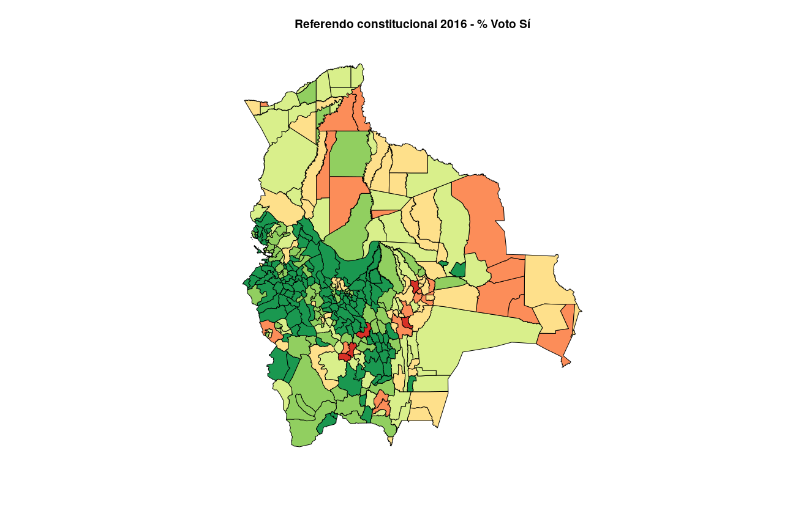
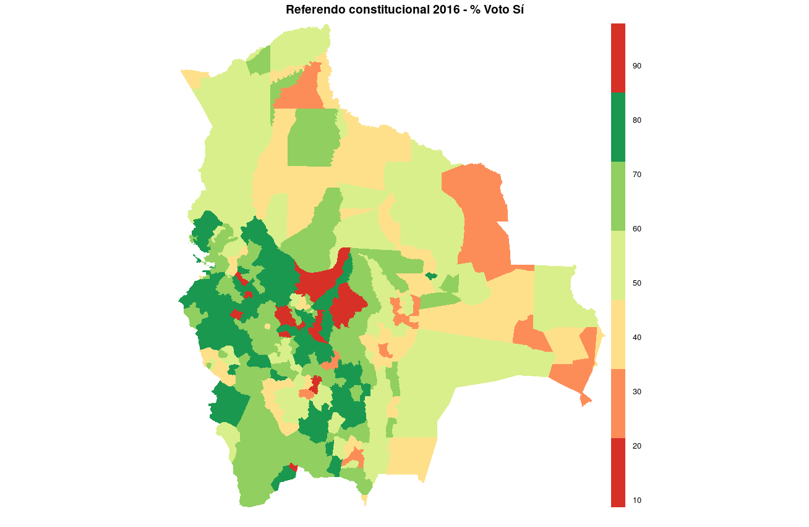
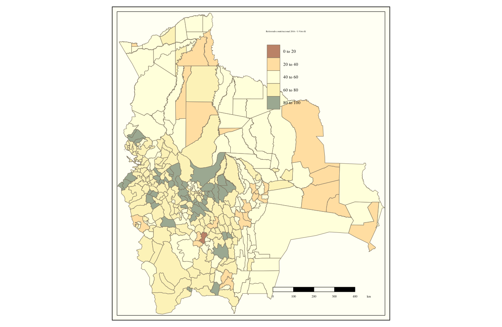

**Mapas coropléticos**

Datos: Referendo constitucional 2016 en Bolivia (OEP 2016)

Diferentes funciones ofrecen diferentes resultados

| Descripción             |  Gráfico |
:-------------------------:|:-------------------------:
Gráficos base  |  
Spplot  |  
GISTools  |  
TMap  |  
