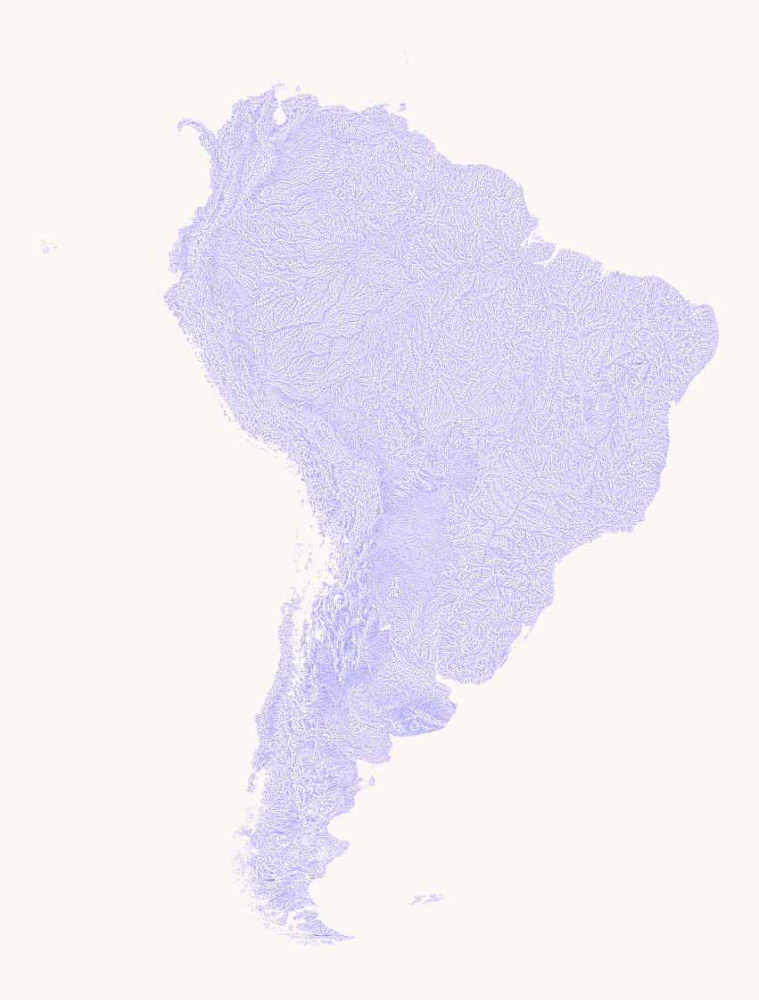
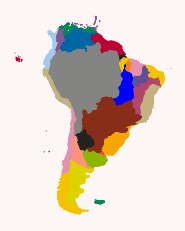
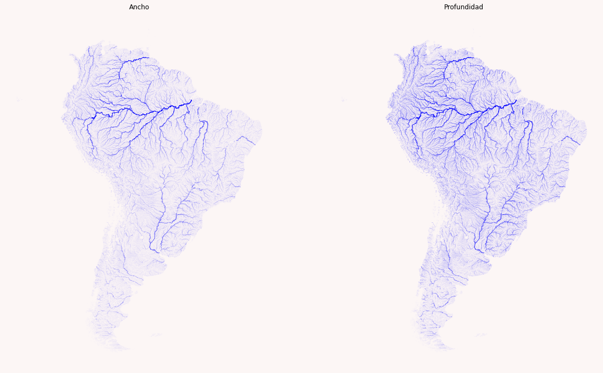
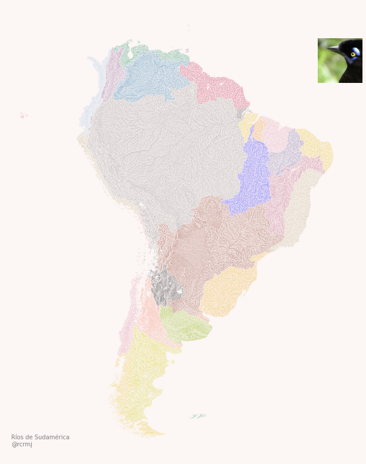
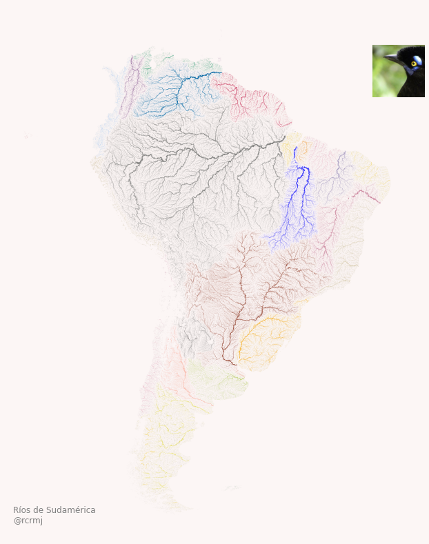

# Mapas de ríos con Python

[Datos fuente - Ríos de Sudamérica](http://gaia.geosci.unc.edu/rivers/data/samerica.zip)

Base de datos global de ríos - Ríos de Sudamérica. [A Simple Global River Bankfull Width & Depth Database](http://gaia.geosci.unc.edu/rivers/)

[Datos fuente - Límites de países y lagos](https://www.naturalearthdata.com/)

Límites administrativos de países del mundo y Lagos del mundo - Natural Earth

[Datos fuente - Cuencas de Sudamérica](https://www.hydrosheds.org/page/hydrobasins)

Cuencas /HydroBASINS/Standard/South America - HydroSHEDS

[Código fuente Python Notebook](beautiful_river_maps_Sam.ipynb)

Mapas creados para Sudamérica a partir código desarrollado por Adam Symington [@PythonMaps](https://towardsdatascience.com/creating-beautiful-river-maps-with-python-37c9b5f5b74c)

---

## Mapas

| Descripción             |  Mapa |
:-------------------------:|:-------------------------:
[Ríos de Sudamérica]  |  
[Cuencas de Sudamérica]  |  
[Ríos con representación de ancho y profundidad]  |  
[Ríos con diferenciación de cuencas]  |  
[Ríos con representación de profundidad]  |  
[Ríos con representación de profundidad y distinción de cuenca]  |  
